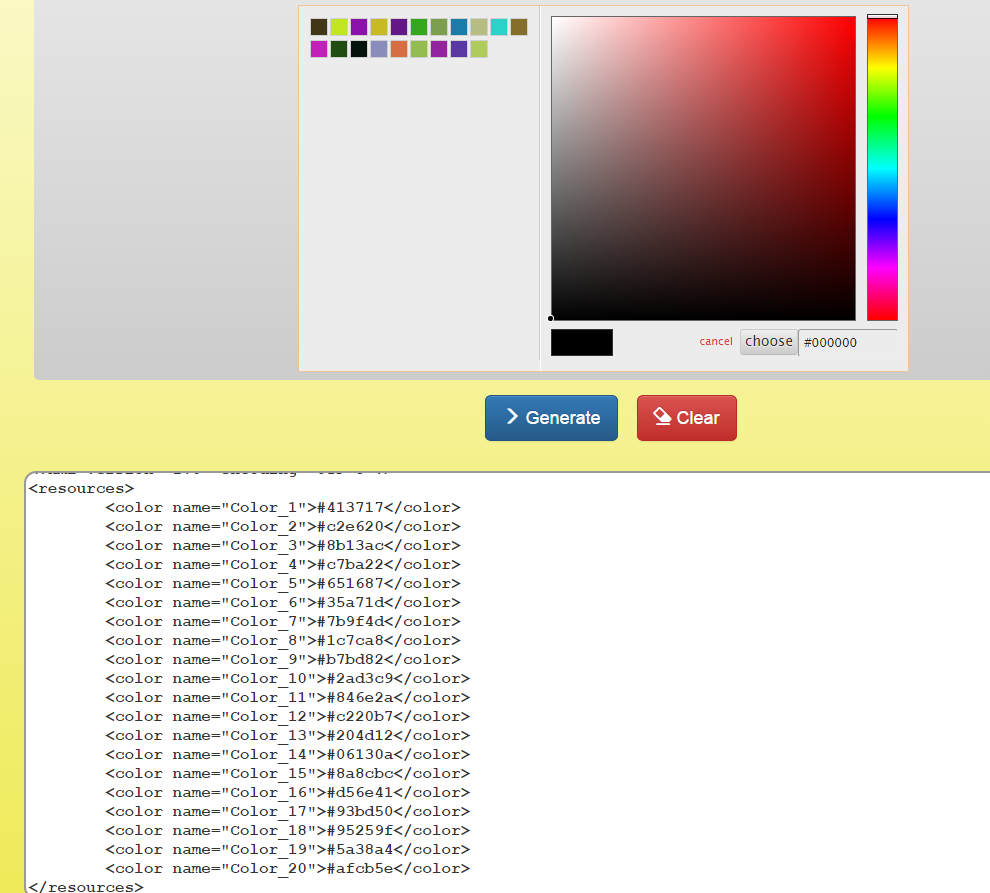

# android-color-generator

<h2>Description</h2>
A <code>colors.xml</code> file generator for Android.

<em>Demo:</em> <a href="http://toubou91.github.io/android-color-generator/" target="_blank">http://toubou91.github.com/android-color-generator/</a>

<h3>Example</h2>
A use case where the user has selected 20 colors:

  

